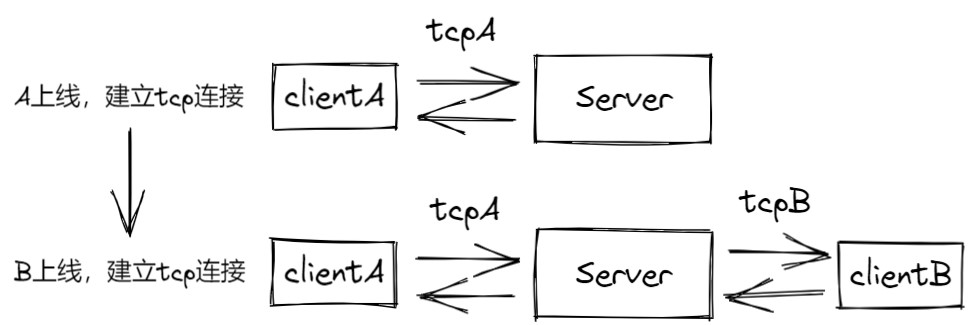
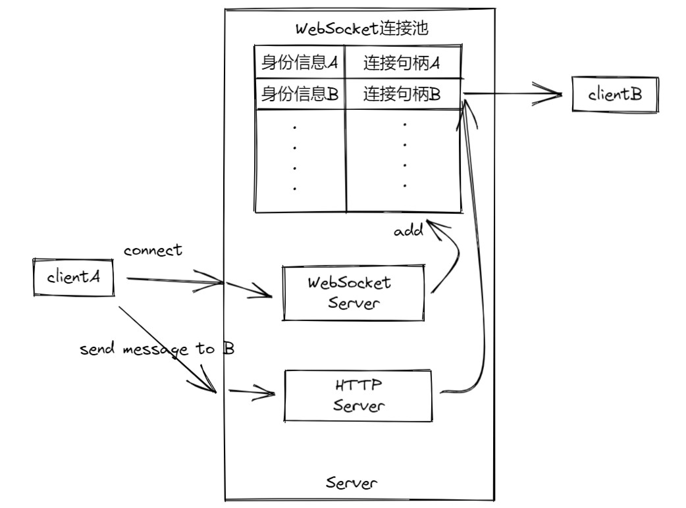
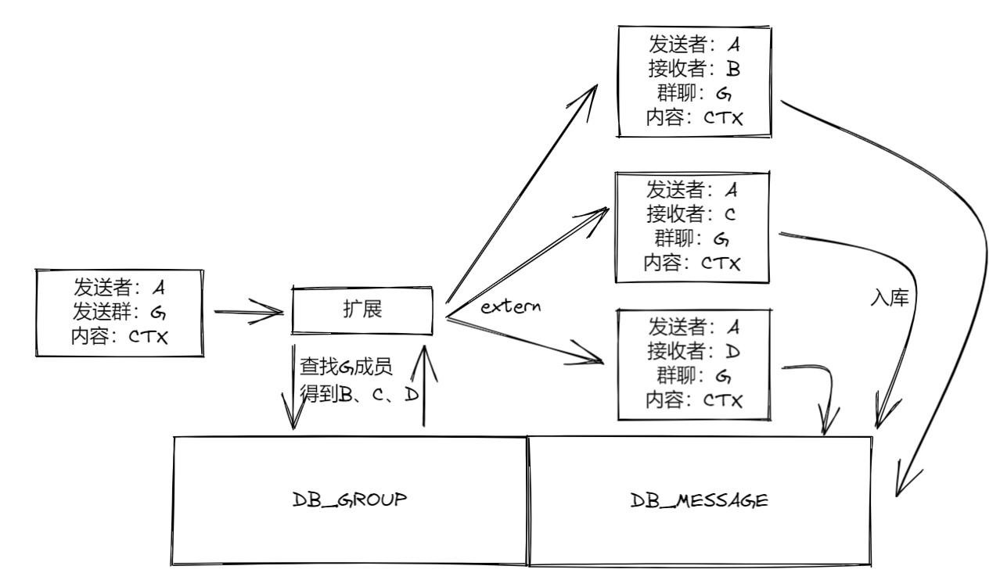
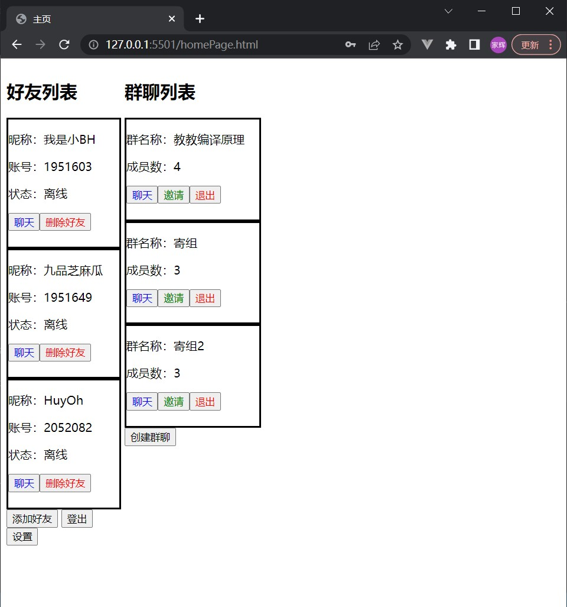
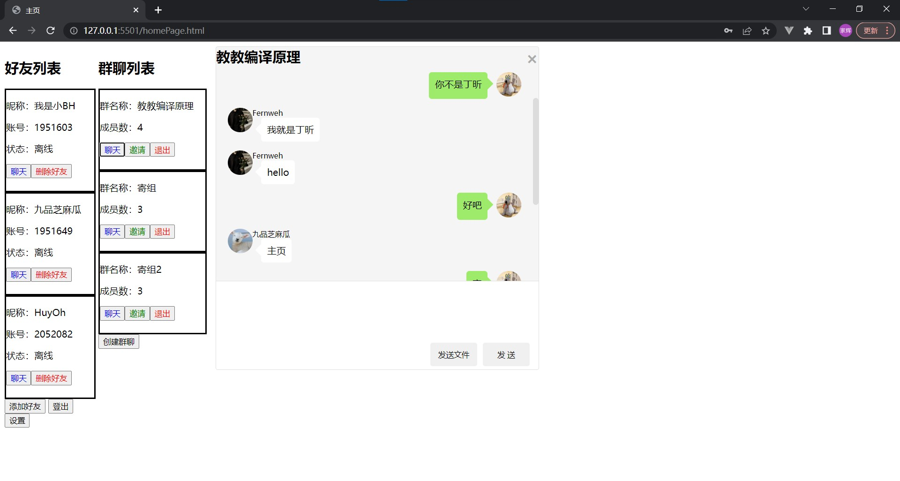
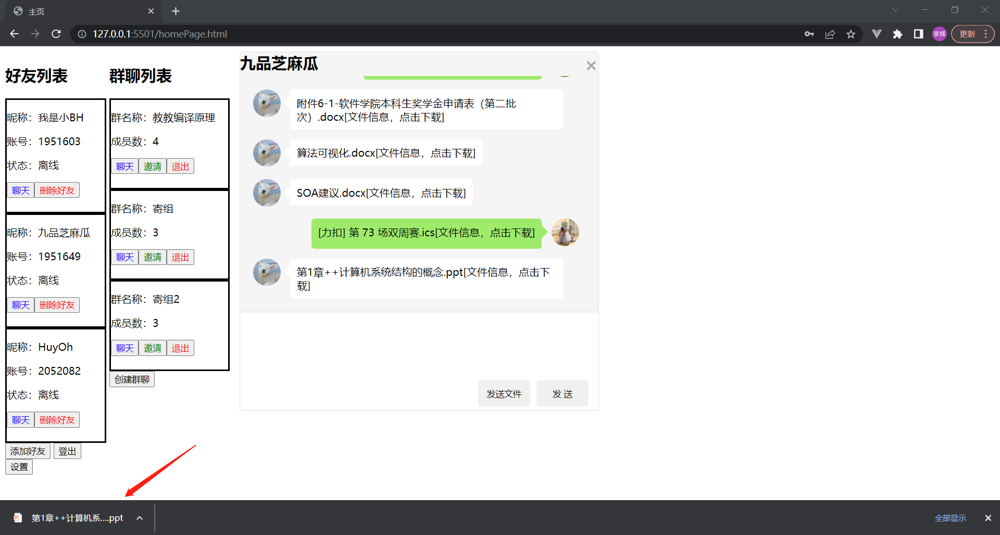

# TJChatRoom设计文档

## 实现功能
* [x] 登录注册
* [x] 信息修改
* [x] 好友系统
* [x] **群聊系统**
* [x] **实时聊天**
* [x] **消息提醒**（扩展）
* [x] **收发文件**
* [x] 历史记录

## 项目结构
项目为前后端分离架构，后端采用golang语言开发，**没有使用框架**，连接mongoDB数据库。前端使用HTML、CSS、JavaScript开发，**没有使用框架**。

## 后端篇
### 1、目录结构
```
.
├── config
│   └── config.json
├── db
│   ├── db.go
│   ├── go.mod
│   └── go.sum
├── dto
│   ├── dto.go
│   ├── go.mod
│   └── go.sum
├── entity
│   ├── entity.go
│   ├── go.mod
│   └── go.sum
├── go.mod
├── go.sum
├── method
│   ├── go.mod
│   ├── group.go
│   ├── message.go
│   └── user.go
├── README.md
├── server.go
├── socket
│   ├── go.mod
│   ├── go.sum
│   └── socket.go
└── tool
    ├── go.mod
    ├── go.sum
    ├── token.go
    └── tool.go
```
`entity`目录负责的主要功能是实体集的操作；`db`目录负责的主要功能是数据库操作；`method`目录负责的主要功能是对db目录提供的功能做进一步封装，并提供给更高层的服务所使用；`dto`目录负责的主要功能是接受前端通过http请求传到后端的参数以及发送通过http响应返回给前端值。`tool`目录负责的主要功能是一些和数据库配置、身份验证有关的操作；`socket`目录负责的主要是实时通信；最后`server.go`中是所有http请求的实现，是程序的入口。
### 2、HTTP Server
一些普通的操作，如添加好友、创建群聊等，这些操作的基本形式为前端发送添加好友的请求，后端接受到以后对请求做对应的处理，之后不再有进一步交互。所以对于这些操作，后端仅需要写几个api处理请求即可。各个api的接口如下：
``` go
http.HandleFunc("/register", register)       // 注册
http.HandleFunc("/login", login)             // 登录
http.HandleFunc("/friends", handleFriends)   // 添加好友
http.HandleFunc("/groups", handleGroups)     // 群聊
http.HandleFunc("/messages", handleMessages) // 发送信息
http.HandleFunc("/file", handleFiles)        // 发送文件
http.HandleFunc("/avatar", handleAvatar)     // 头像操作
http.HandleFunc("/user", handleUser)         // 用户操作
http.ListenAndServe(":8888", nil)
```
### 3、数据库和实体
以前我们使用的大多为关系型数据库如MySql、Oracle等，当然，这个项目用关系型也能做，但是本着尝试新事物的态度，用了MongoDB作为数据库。MongoDB是一个文档型数据库，数据库中的内容主要以文档形式存储，由于聊天系统需要存聊天信息，而聊天信息又非常适合以文档的形式存，这也是使用MongoDB的一个原因。
数据库中共3个`Collection`，分别是`User`、`Group`、`Message`，存着用户信息、群聊信息、聊天信息，相应的实体如下：
``` go
type User struct {
	Account  string
	Passwd   string
	NickName string
	Friends  []Friend // 所加好友
	Group    []string // 加入的群聊
	Avatar   string   // 头像
}

type Friend struct {
	Friend string `json:"friend"`
}

type Group struct {
	Id      primitive.ObjectID `bson:"_id"`
	Members []Member           // 群成员
	Name    string             // 群名称
	Owner   string             // 群主
	// CreateTime time.Time // 群创建时间
}

type Member struct {
	Member string
}

type Message struct {
	Time        int64  // 信息发送时间
	Group       string // 信息所属群聊（若是私信，此项为空）
	From        string // 信息发送者
	To          string // 信息接收者
	Read        bool   // 信息接收者是否已经阅读过该消息
	ContentType int    // 信息内容类型（文本or文件）
	Content     string // 信息内容，对于文件，表示文件名，确切说是上传时的文件名
	RemoteName  string // 仅用于信息内容为文件，表示存在oss中的文件名，为了避免重名
	// 获取文件资源时，用的时RemoteName，而用户下载文件的时候，用的还是Content
}
```
### 4、实时聊天
我设计的实时聊天系统模型：用户A给用户B发送消息，并不会直接把消息发送给B，而是先发送到服务器，服务器把聊天信息存到数据库里后再把信息转发给用户B，这么做可以避免因用户B不在线而导致的消息丢失的问题。
普通的HTTP Server并不能满足聊天的实时性需求，这主要是因为，普通的HTTP Server只能接受来自客户端的请求，并对当次请求做反馈，但是它并不能“主动”联系客户端，也就是说对于上面设想的流程，HTTP能做到将发送给服务器并保存到数据库，但是无法做到将信息转发给用户B。
实际上**TCP**连接很适合上面说的信息转发，因为一旦TCP连接建立，两端都能够发信息，示意图如下：

clientA发送给clientB的消息，先通过tcpA发送给Server，然后Server通过tcpB发送给clientB。
然而由于前端是通过JavaScript开发的，JavaScript似乎并不支持tcp通信，不过它支持**WebSocket**，WebSocket提供使用一个TCP连接进行双向通讯的机制，它本身是通过tcp实现的，也能实现上面的功能。而golang也有功能完整的第三方WebSocket库，所以本项目使用的是WebSocket进行实时的消息通信。
事实上这里采取的是这样一种方案，在内存中设置一个WebSocket连接池，客户端上线后就与服务端建立WebSocket连接，并把该连接连同用户身份信息一起放到连接池中。当A给B发送信息的时候，在A向服务器发送信息这一阶段，采用的仍然是HTTP服务，而在服务器向B转发信息这一阶段，服务器现在WebSocket池中根据身份信息找到B的连接，通过该连接将信息转发给B，示意图如下：

WebSocket连接池的结构如下：
``` go
type LiveClient struct {
	Account string
	Conn    *websocket.Conn
	ChMsg   chan string
}
var liveClients []LiveClient
var mu sync.Mutex
```
`Account`字段表示身份信息，`Conn`字段表示连接句柄，`ChMsg`的作用后文会讲。因为存在数据竞争，这里用了锁`sync.Mutex`来保护。

### 5、消息状态
为了实现消息提醒，在本项目中，对于发送成功的信息（即发送到服务器）有两个状态：（对方）已读和（对方）未读。当消息到达服务器时，消息的状态默认时未读的。当且仅当消息通过WebSocket发送给接收者并且接收者给服务器发送了确认已读的信号，消息状态才能改为已读。从这里可以看到WebSocket的作用主要是两个：1、服务端转发消息给客户端；2、客户端给服务端发送反馈。下面两个函数的作用分别是服务端给客户端发送消息以及监听客户端的反馈：
``` go
func notice(msg entity.Message) {
	account := msg.To
	clientPtr := socket.FindClient(account)
	if clientPtr == nil {
		log.Println(account, "对方不在线")
		method.AddMessage(msg, false)
		return
	}
	client := *clientPtr
	res, _ := json.Marshal(msg)
	err := client.Conn.WriteMessage(websocket.BinaryMessage, res)
	if err != nil {
		log.Println("发送失败", err)
		method.AddMessage(msg, false)
		return
	}
	timeStart := time.Now()
	for {
		select {
		case <-client.ChMsg:
			fmt.Println("消息已读")
			method.AddMessage(msg, true)
			return
		default:
			if interval := time.Since(timeStart).Milliseconds(); interval > 500 {
				method.AddMessage(msg, false)
				return
			}
			time.Sleep(time.Millisecond * 100)
		}
	}
}
```
服务端转发信息给客户端后需要监听客户端的响应，在同一时间内，每个WebSocket连接只能有一个监听，否则多个监听端的结果将变得不可预测。`ReadMessage`函数能够监测WebSocket是否正常连接，一旦客户端断开连接，它就会立刻返回错误。出于上述考虑，加入一个函数专门用于监听客户端响应以及监控客户端状态：
``` go
func (liveClient *LiveClient) Reader() {
	account := liveClient.Account
	conn := liveClient.Conn
	chMsg := liveClient.ChMsg
	// go heartBeat(account, conn, chMsg)
	for {
		fmt.Println("reader is alive!")
		// fmt.Println(conn)
		_, p, err := conn.ReadMessage()
		if err != nil {
			fmt.Println("客户端断开连接")
			RemoveClient(account)
			return
		}
		fmt.Println("收到了来自客户端的反馈：", string(p))
		chMsg <- string(p)
	}
}
```
一旦`Reader`收到了客户端的响应，就把响应的信息通过**信道**(chMsg)发送给等待响应的`notice`
考虑存在网络延时等原因，客户端可能不会返回，所以`notice`函数每100ms会查看一下信道是否有信息，如果500ms后仍没有受到信道的信息（即客户端的响应），就把信息以未读(false)的状态存到数据库中，否则把信息以已读(true)的状态存到数据库中。**这种先等待再存库的方法可以有效减少操作数据库的次数，从而提高了系统的性能。**

### 6、群聊
个人聊天的信息和群聊信息存在同一个Collection中，并通过标志位`Group`来表明这是否是一条群聊信息。除此之外，群聊信息和个人聊天信息没有任何不同。当用户在一个群中发了一条信息后，向后端发送http请求，包括以下字段：
``` go
type MessageForCreation struct {
	Time        int64  `json:"time"`        // 信息发送时间
	Group       string `json:"group"`       // 信息所属群聊（若是私信，此项为空）
	From        string `json:"from"`        // 信息发送者
	To          string `json:"to"`          // 信息接收者
	Content     string `json:"content"`     // 信息内容
}
```
后端根据Group信息，扩展(extern)群聊内容后入库，如下图所示：

这么做的好处是使群聊信息和普通信息一样，易于管理，并且每个群成员对同一条信息的已读还是未读状态可能都不一样，这么做（每个群成员对每一条群信息单独维护）可以支持这种差异性。但是带来的问题是数据的冗余，因为同一条信息被存了多次。

### 7、文件
`Message`中预留了文件信息的字段：
``` go
type Message struct {
	Time        int64  // 信息发送时间
	Group       string // 信息所属群聊（若是私信，此项为空）
	From        string // 信息发送者
	To          string // 信息接收者
	Read        bool   // 信息接收者是否已经阅读过该消息
	ContentType int    // 信息内容类型（文本or文件）
	Content     string // 信息内容，对于文件，表示文件名，确切说是上传时的文件名
	RemoteName  string // 仅用于信息内容为文件，表示存在oss中的文件名，为了避免重名
	// 获取文件资源时，用的时RemoteName，而用户下载文件的时候，用的还是Content
}
```

## 前端篇
一共4个页面：`homePage.html`、`login.html`、`register.html`、`settings.html`
登录注册：

主页：

聊天：

传文件：

……
更多功能不便于图片展示，请登录网页查看：118.31.108.144:8023/TJChatRoomClient/login.html
提供三个现成的账号：
| 账号 | 密码 |
|-|-|
| 1951603 | 123456 |
| 1951649 | 123456 |
| 2052082 | 123456 |
| 1951597 | 123456 |

## TODO
+ 用户状态监控
+ 好看的界面